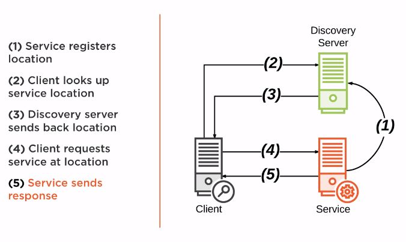

# Service Discovery Service

Provides :
- A way for a service to register and deregister itself
- A way for a client to find other services
- A way to check the health of a service and remove the unhealthy instances.

Some tools that provides the discovery services are:
- Spring Cloud Consul
- Spring Cloud Zookeeper
- Spring Cloud Netflix

We will focus on Spring Cloud Netflix:
- Spring Cloud Netflix Eureka Server
- Spring Cloud Netflix Eureka client.

## Discovery diagram

